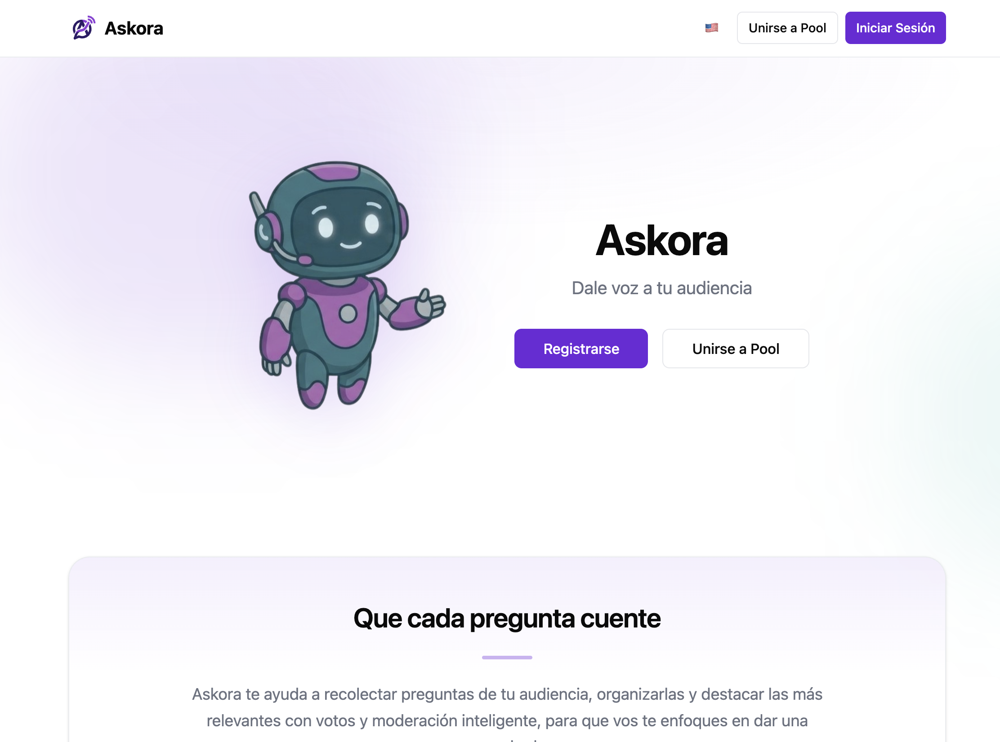
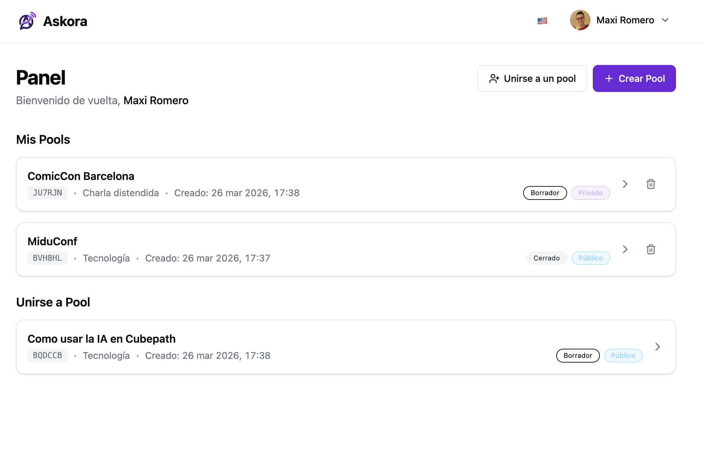
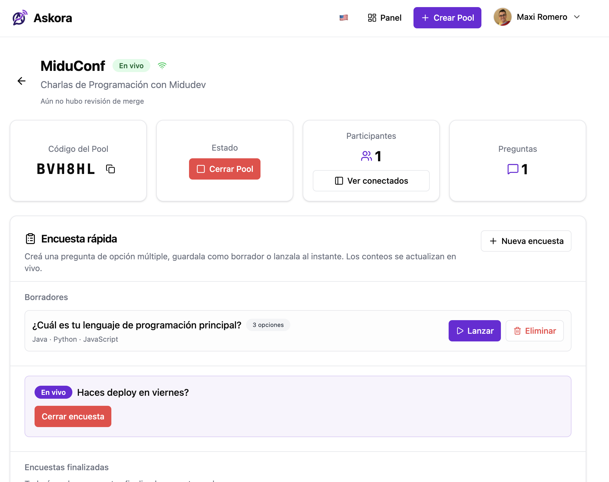
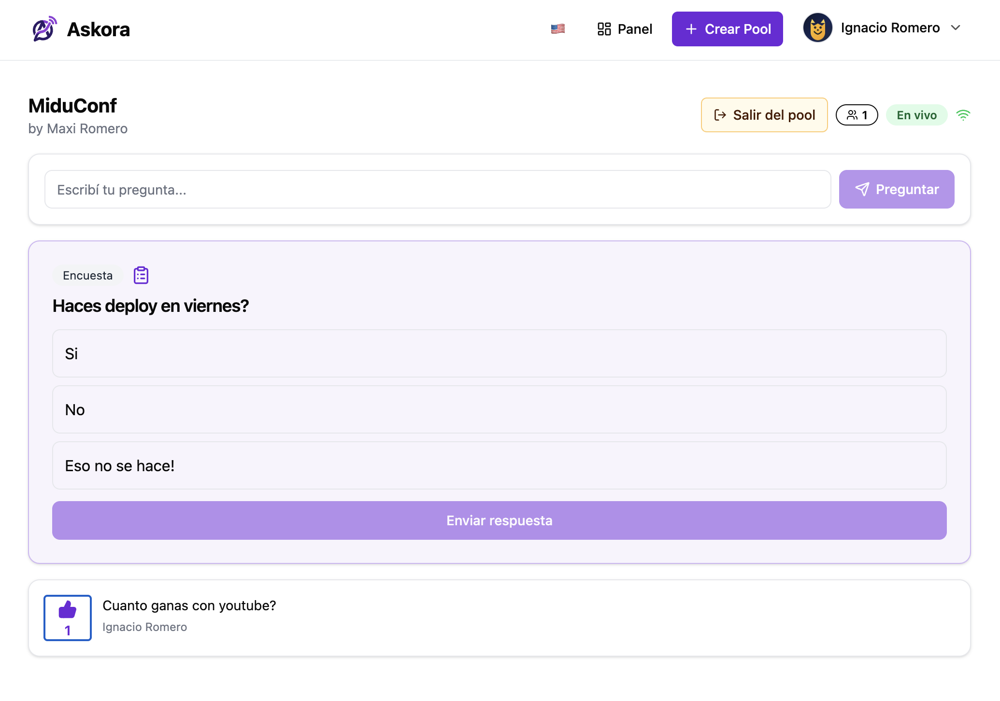
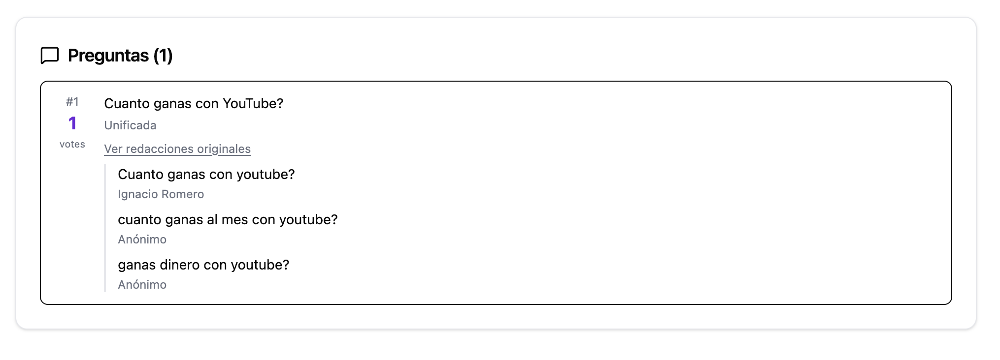
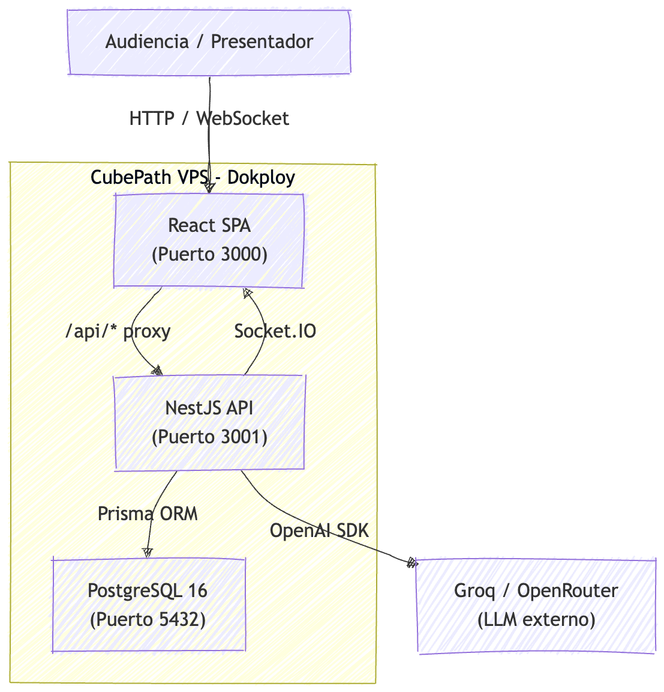

<div align="center">


# Askora

### Dale voz a tu audiencia

Plataforma de preguntas y respuestas en tiempo real para presentaciones, clases, streams y eventos. Con fusión inteligente de preguntas por IA, moderación automática e interacción en vivo.

[](https://askora.cubepath.app)
[](https://github.com/midudev/hackaton-cubepath-2026)
[](LICENSE)

</div>

---

<table>
<tr>
<td width="120" align="center">

</td>
<td>

## El problema

En charlas, clases y eventos en vivo, la audiencia quiere preguntar pero los canales se saturan: el chat se pierde, las preguntas se repiten y el presentador no sabe cuáles priorizar. Las mejores preguntas quedan enterradas entre cientos de mensajes.

## La solución

**Askora** organiza las preguntas de tu audiencia en tiempo real. Los participantes envían preguntas, votan las que más les interesan, y la IA agrupa automáticamente las que son similares. El presentador ve un panel limpio con las preguntas más relevantes y puede lanzar encuestas rápidas, todo sin interrumpir el flujo del evento.

</td>
</tr>
</table>

---

## Funcionalidades

| | Funcionalidad | Descripción |
|:---:|---|---|
| **Q&A en tiempo real** | Preguntas y votos instantáneos via WebSockets con Socket.IO |
| **Fusión por IA** | Las preguntas similares se agrupan automáticamente usando LLMs (Groq / OpenRouter) |
| **Moderación inteligente** | Filtros de contenido integrados + reglas personalizadas del creador |
| **Encuestas rápidas** | El presentador puede lanzar encuestas de opción múltiple en vivo |
| **Bilingüe** | Soporte completo en español e inglés con detección automática de idioma |
| **Anónimo o con nombre** | Los participantes eligen su nivel de identidad al unirse |
| **Pools públicos y privados** | Crea sesiones abiertas o protegidas con clave de acceso |

---

## Capturas de pantalla








---

## Arquitectura



La aplicación se despliega como **3 servicios Docker** orquestados con Docker Compose:

- **web** — SPA de React construida con Vite, servida como sitio estático (Nginx)
- **api** — Servidor NestJS con WebSockets (Socket.IO), autenticación JWT/Google OAuth y conexión a LLMs
- **db** — PostgreSQL 16 Alpine con volumen persistente

---

## Stack tecnológico

<table>
<tr>
<td><strong>Frontend</strong></td>
<td>React 19, Vite, TailwindCSS v4, shadcn/ui, Zustand, Socket.IO Client, react-i18next</td>
</tr>
<tr>
<td><strong>Backend</strong></td>
<td>NestJS, Prisma ORM, PostgreSQL 16, Socket.IO, Passport (JWT + Google OAuth)</td>
</tr>
<tr>
<td><strong>IA / LLM</strong></td>
<td>OpenAI SDK con Groq (primario) + OpenRouter (fallback)</td>
</tr>
<tr>
<td><strong>Deploy</strong></td>
<td>Docker Compose sobre Dokploy en VPS de CubePath</td>
</tr>
</table>

---

## Despliegue en CubePath

Askora está desplegado en un **VPS de CubePath** utilizando **Dokploy** como plataforma de gestión de contenedores.

### Proceso de despliegue

1. **Provisión del VPS** — Se creó un servidor en [CubePath](https://midu.link/cubepath) utilizando el crédito gratuito de $15, suficiente para levantar la infraestructura completa.

2. **Instalación de Dokploy** — Se instaló Dokploy en el VPS para gestionar los contenedores Docker de forma visual y con deploys automáticos.

3. **Despliegue con Docker Compose** — Los tres servicios (PostgreSQL, API NestJS, frontend React) se levantan con un solo comando:

   ```bash
   docker compose up --build -d
   ```

4. **Configuración de red** — Dokploy gestiona el reverse proxy (Traefik) y los certificados SSL, exponiendo la aplicación en `[Tengo que completar esto cuando termine de desplegar]`.

### Servicios desplegados

| Servicio | Imagen | Descripción |
|---|---|---|
| `db` | `postgres:16-alpine` | Base de datos PostgreSQL con volumen persistente |
| `api` | Build custom (NestJS) | API REST + WebSocket server |
| `web` | Build custom (Vite + Nginx) | SPA de React servida como sitio estático |

---

## Desarrollo local

### Requisitos previos

- Node.js 20+
- Docker y Docker Compose

### Inicio rápido

```bash
# Levantar PostgreSQL
docker compose up db -d

# Instalar dependencias
npm install --workspaces

# Configurar variables de entorno
cp .env.example apps/api/.env

# Ejecutar migraciones de base de datos
cd apps/api && npx prisma migrate dev && cd ../..

# Iniciar ambas apps en desarrollo
npm run dev
```

- Frontend: http://localhost:5173
- API: http://localhost:3001

### Variables de entorno

Copia `.env.example` y completa los valores:

| Variable | Requerida | Descripción |
|---|:---:|---|
| `DATABASE_URL` | Si | String de conexión a PostgreSQL |
| `JWT_SECRET` | Si | Secreto para firmar tokens JWT |
| `GROQ_API_KEY` | No | API key de Groq para funciones de IA |
| `OPENROUTER_API_KEY` | No | API key de OpenRouter (fallback) |
| `GOOGLE_CLIENT_ID` | No | Client ID para Google OAuth |
| `GOOGLE_CLIENT_SECRET` | No | Client Secret para Google OAuth |

### Deploy a producción (Dokploy)

```bash
docker compose up --build -d
```

---

## Estructura del proyecto

```
askora/
├── apps/
│   ├── web/                # Frontend React (Vite + TailwindCSS)
│   │   ├── src/
│   │   │   ├── pages/      # Páginas: Home, Login, Dashboard, Pool, Live...
│   │   │   ├── components/ # Componentes UI (shadcn/ui + custom)
│   │   │   ├── stores/     # Estado global (Zustand)
│   │   │   ├── i18n/       # Traducciones (EN/ES)
│   │   │   └── lib/        # Utilidades, API client, Socket.IO
│   │   └── Dockerfile
│   └── api/                # Backend NestJS
│       ├── src/
│       │   ├── auth/       # Autenticación (JWT + Google OAuth)
│       │   ├── pools/      # Pools: CRUD, Gateway WebSocket
│       │   ├── questions/  # Preguntas + servicio de fusión por IA
│       │   ├── polls/      # Encuestas rápidas
│       │   ├── moderation/ # Moderación de contenido
│       │   ├── llm/        # Integración con Groq / OpenRouter
│       │   └── prisma/     # Cliente Prisma
│       ├── prisma/
│       │   └── schema.prisma
│       └── Dockerfile
├── docker-compose.yml      # Orquestación de los 3 servicios
├── .env.example            # Template de variables de entorno
└── package.json            # Monorepo con npm workspaces
```

---

## Licencia

MIT
